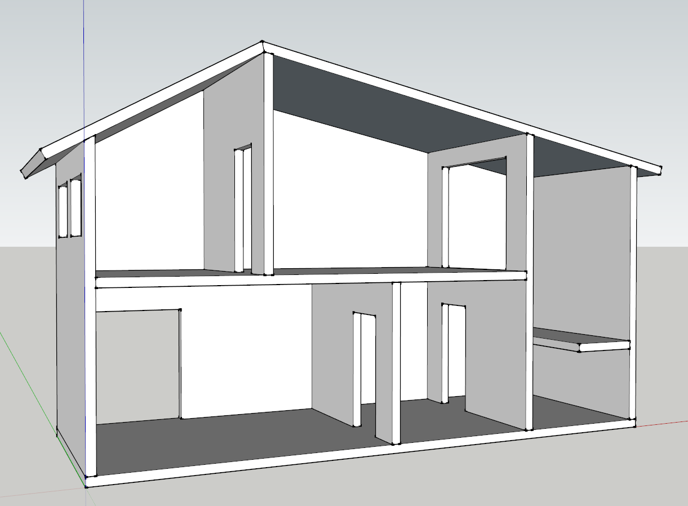

# Doll House #

A birthday present for my daughter. This was quite the learning project for me. 
For instance, I learned that it is better to cut a sheet of plywood down over-size,
then cut the exact pieces on the tablesaw. You are just not going to get great
accuracy otherwise.

The doors and windows were cut by making a few router jigs (basically oversized
squares inside which the router could run).

All the pieces were attached using woodglue and brad nails.

## Materials ##

- (1) 1/2" sheet of red oak plywood
- Primer and paint
- Polyurathane