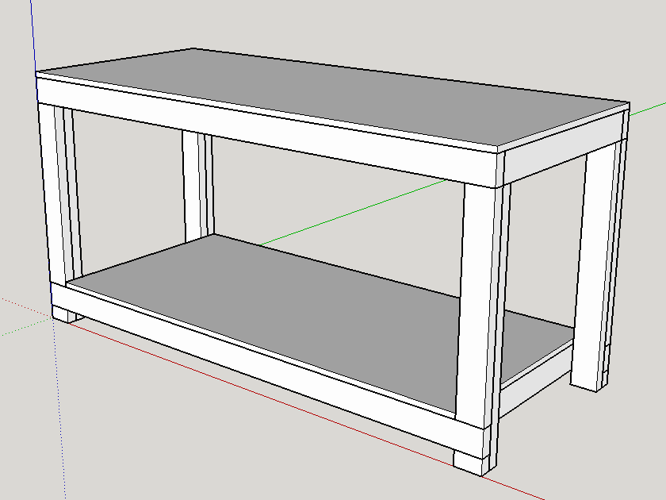
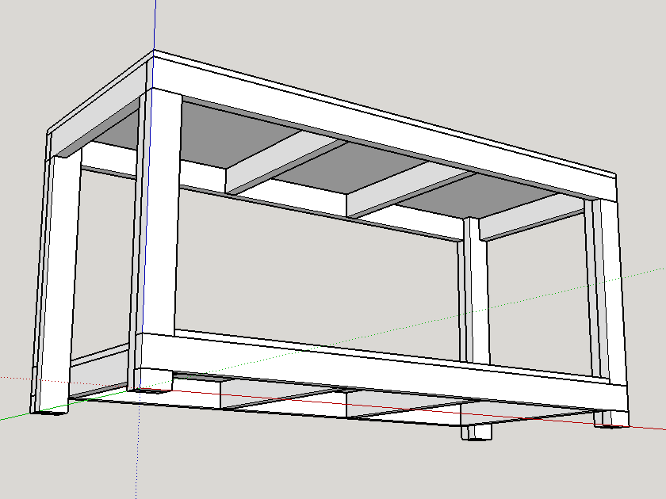

# Workbench #

This was the first project I did in my garage, basically to be able to other
projects more easily. The only addition not shown here is the wheels I added
to the bottom of the legs. I did not finish the top, since it is made out of
MDF, it meant to be easily replaceble after taking a beating.

The workbench ends up being quite tall if you follow the plans exactly, but
that is a personal preference, and can of course be adjusted.

I am currently using the bottom shelf for storing my compressor, and perhaps
eventually a dust collection system.

## Materials ##

- (8) 2x4s for the legs (plus some scraps I had left over)
- (1) 4x8 sheet of MDF for the top and shelf

## Legs ##

Note the special way in which the legs are notched in:

I used my speed-square and skillsaw to cut the grooves which basically hold the
top plate in place.

## Future Plans ##

- Add a power strip
- Add a dust collection system.